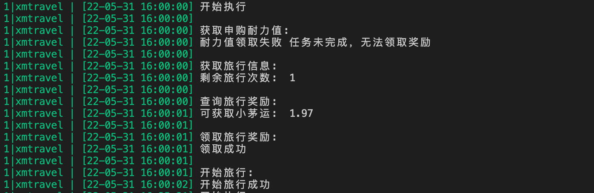

## i 茅台 APP 小茅运活动

> nodejs 实现小茅运旅行活动自动执行

### TODO

- [x] 自动旅行
- [x] 每日首次旅行分享
- [x] 领取申购耐力值

### 安装

```shell
npm i -g pm2
git clone git@github.com:mrabit/xmtravel.git
cd xmtravel
npm install
```

### 启动

```shell
cp config.example.js config.js
# 脚本启动
pm2 start script.json
# 日志查看
pm2 logs xmtravel --out --lines=100 
```



### 免责申明

本代码仅用于学习，下载后请勿用于商业用途
